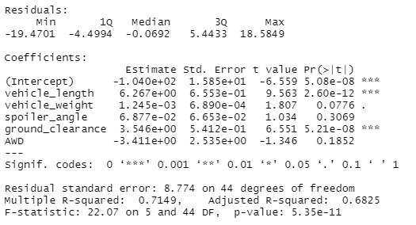
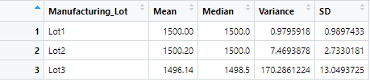
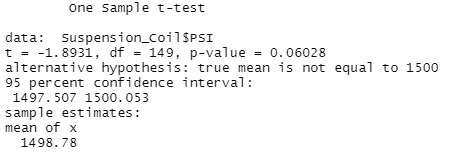
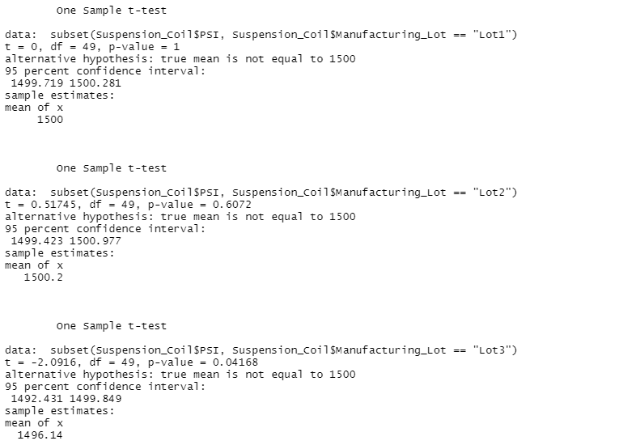

# MechaCar Statistical Analysis with R: Calculating Determinates of Miles per Gallon and Comparing Suspension Coils in R

## Overview of Project

### Purpose
The purpose of this analysis to determine which variables can predict the miles per gallon (MPG) of MechaCar prototypes using linear regression; assessing summary statistics, most notable variance, of suspension coils' pounds per square inch (PSI); and determining if there is a difference between the sampled means of prototypes' suspension coils' PSI with the presumed population mean. The dataset on MechaCar prototypes' MPG includes vehicle length, vehicle weight, spoiler angle, ground clearance, whether or not it is all-wheel drive (AWD), and the MPG. The dataset on MPG includes 50 rows for 50 sampled prototypes. The dataset on the suspension coil includes the vehicle's ID, its manufacturing lot, and its PSI. The dataset on suspension coils include 150 rows for 150 sampled suspension coils, includes three lots, and the PSI varies from 1452 to 1542. This assessment should allow AutosRU to determine insights from the production data to help the manufacturing team overcome problems in their progress in further developing the new vehicle. Suggestions will also be made for future statistical studies to assess the vehicle performance of MechaCar vehicles against vehicles from other manufacturers.

## Linear Regression to Predict MPG

In the above image is the summary of the linear regression for determinants of the dependent variable of MPG based on the independent variables of vehicle length, vehicle weight, spoiler angle, ground clearance, and AWD. Ignoring the intercept, the Pr(>|t|) value, representing the probability that each coefficient contributes a random amount of variance to the linear model, of each are 2.60E-12, 0.0776, 0.3069, 5.21E-08, and 0.1852 respectively. At the assumed statistical significance level of an alpha of 0.05, vehicle length and ground clearance provide a non-random amount of variance to the MPG as they are the variables with Pr(>|t|) below the presumed alpha of 0.05 for statistical significance so we can presume they have a large statistical impact.

Initially, we might describe the slope of the linear model is non-zero given that each of the coefficients of the variables contain a non-zero value. Generally, the model states that as AWD increases and all other variables are held constant then this would decrease MPG while for all the other variables as they increase while AMD is held constant then the MPG would increase. However, we do not have sufficient evidence that all of the coefficients vary from zero given their values for Pr(>|t|). As we only have sufficient evidence to claim that vehicle length and ground clearance have a non-random statistical impact then the model can be described a non-zero and positive given the coefficients for these variables are positive and are statistically significant.

Generally speaking, the linear model appears to predict MPG of MechaCar prototypes effectively as the R-squared value, which represents the proportion of variance in the MPG explained by all the independent variables listed is 0.71 which means that 71% of the variation in MPG has been explained. Additionally, the overall model is statistically significant as its p-value is 5.35E-11 which is way below the assumed statistical significance level of an alpha of 0.05. The model could be improved with the inclusion of more samples and more determining variables.

## Summary Statistics on Suspension Coils

The design specifications for the MechaCar suspension coils dictate that the variance of the suspension coils must not exceed 100 PSI. For the current manufacturing data, if we are looking at all manufacturing lots in total then this design specification is met as the variance is 62.29356 PSI. As for each lot individually then no. This is given that, although lot 1 and lot 2 do meet this specification with a variance of 0.9795918 PSI and 7.4693878 PSI, lot 3 does not with a variance of 170.2861224 PSI. This is displayed in the summary statistics above.

## T-Tests on Suspension Coils

The t-Test is designed to check between the null hypothesis, that there is no difference between the observed sample mean for suspension coils' PSI and the presumed population of mean of 1,500 PSI, and the alternative hypothesis, that there is a difference between the observed sample mean for suspension coils' PSI and the presumed population of mean of 1,500 PSI.

Above is the t-test for the total of all manufacturing lots in total which notes that the sample mean is 1498.78 with a 95% confidence interval of 1,497.507 to 1,500.053 but has a p-value of 0.06028 which is above our presumed alpha of 0.05. 

So it is the case that the t-test seems to infer that the mean of PSI in the firm's total sample of manufacturing lots is not different from the presumed population mean of 1,500 based on the confidence interval and because the p-value is higher than the presumed alpha then we cannot reject the null hypothesis that there is no difference between the observed mean and the presumed population of mean of 1,500 PSI on the grounds of insufficient evidence to ensure that we are not making a type I error of rejecting the null hypothesis when it can be actually true that there is no difference between the observed mean and the presumed population of mean of 1,500 PSI.

Above is the t-test for the total of all individual manufacturing lots which notes that the sample means are 1,500 for lot 1, 1,500.2 for lot 2, and 1,496.14 for lot 3 and that there is a 95% confidence interval of 1,499.719 to 1,500.281 for lot 1, 1,499.423 to 1,500.997 for lot 2, and 1,492.431 to 1,499.849 for lot 3. Additionally, the p-values are 1 for lot 1, 0.6072 for lot 2, and 0.04168 for lot 3.

For lot 1 and lot 2, there are p-values of 1 and 0.6072 respectively are both above our presumed alpha of 0.05. So for lot 1 and lot 2, it is the case that the t-test seems to infer that the mean of PSI in the firm's total sample of manufacturing lots is not different from the presumed population mean of 1,500 based on the confidence interval and because the p-value is higher than the presumed alpha then we cannot reject the null hypothesis that there is no difference between the observed mean and the presumed population of mean of 1,500 PSI on the grounds of insufficient evidence to ensure that we are not making a type I error of rejecting the null hypothesis when it can be actually true that there is no difference between the observed mean and the presumed population of mean of 1,500 PSI. 

However, for lot 3 which as a p-value of 0.04168 which is below our presumed alpha of 0.05, we can reject the null hypothesis and accept the alternative hypothesis that there is a difference between the observed sample mean and the presumed population of mean of 1,500 PSI. This is additionally confirmed by the confidence interval which does not include 1,500.

## Study Design: MechaCar vs Competition

For a statistical study that could allow us to quantify how the MechaCar performs against the competition we can run a series of two-sample t-tests against samples from individual other competitors and for each metric we would like to compare MechaCar with the other firms' cars. The null hypothesis is similar to a one-sample t-test but rather to claim that there is no statistical difference between the two observed sample means and likewise the alternative hypothesis is that there is a statistical difference between the two observed sample means. The two-sample t-test is the best tool in a comparison against competitors given that it allows us to directly compare two samples and what their average properities are generally like. Most likely, the metrics consumers would like to see compared would be MPG, horsepower, projected market price, and projected maintenance cost.

As such, the hypotheses would be there is no statistical difference between the two observed sample means for MPG, or horsepower, or projected market price, or projected maintenance cost for the null hypothesis and that there is a statistical difference between the two observed sample means for MPG, or horsepower, or projected market price, or projected maintenance cost for the alternative hypothesis depending on which metric the t-test is being run at the time.

We would likely need data for each one of these metrics for MechaCar and its competitor vehicles, from randomly selected samples, and at a large enough sample size for us to conduct a two-sample t-test. For MPG, the data is obviously miles per gallon as a unit of measurement and as a quantitative continuous distribution. For horsepower, the data is obviously horsepower as a unit of measurement and as a quantitative continuous distribution. For projected market price and projected maintenance cost, the unit of measurement is nominal value in US Dollars and are quantitative continuous distributions.
